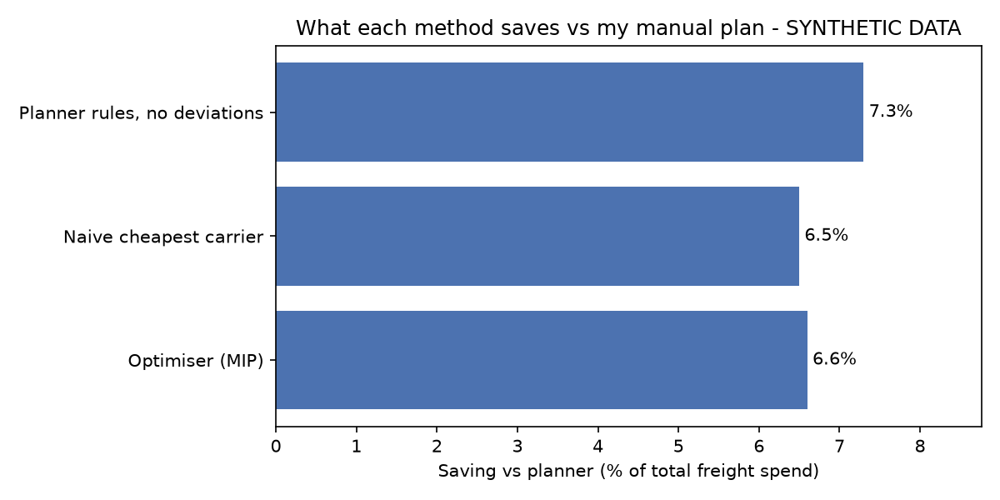
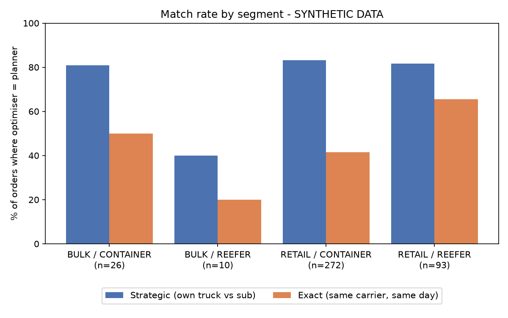
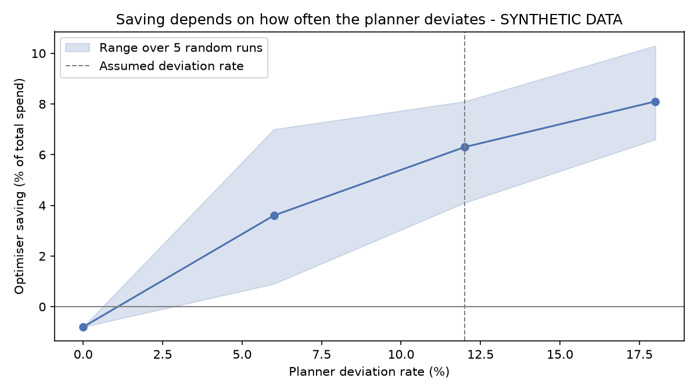

# Carrier Allocation Optimiser

**Own truck or subcontractor? A dispatch optimiser for a Vietnamese 3PL's Hanoi → Ho Chi Minh City corridor, tested against the manual rules I used as its transport planner.**

> ⚠️ **All data in this project is synthetic.** The company's records exist only on paper, so I built a simulated order book and cost model from my own operating experience. Every assumed number is tagged `# CALIBRATE` in the code. The results show how the method works and what it can find. They are not audited savings from real operations.

---

## Headline

On a 60-day synthetic order book (401 orders, spanning Tết 2026):

- **The optimiser reproduces the planner's own-truck vs subcontract decision ~81% of the time.**
- **It identifies 6.6% of total freight spend as theoretically addressable where it disagrees.**

The more useful finding is where that 6.6% comes from:

| Method | Saving vs manual plan (% of total spend) |
|---|---|
| My written rules, applied consistently (no deviations) | **7.3%** |
| Optimiser (PuLP MIP) | 6.6% |
| Naive "always cheapest carrier" | 6.5% |

**The saving comes from consistency, not from the maths.** My rules were already close to cost-optimal. The loss came from the ~12% of day-to-day decisions where a planner breaks them. The optimiser beats a naive cheapest-carrier rule by only 0.1 points, and I'm reporting that as it is.

---

## The business problem

The 3PL runs about 15 of its own long-haul trucks (10 container, 5 reefer) from Hanoi to Ho Chi Minh City. It handles two kinds of booking:

- **Bulk:** one customer fills a whole truck, which stops at Nghe An/Ha Tinh, Dak Lak and HCMC (about 4 days).
- **Retail:** many customers' cartons are consolidated onto one truck running direct to HCMC (about 3 days).

A round trip takes about 12 days, so on busy days there aren't enough trucks in Hanoi. The planner then phones one of three subcontracted long-haul carriers (A, B, C). They charge about 1.5M, 3M and 4.5M VND more than our own marginal trip cost.

Every day, the planner decides which orders go on our own trucks, which get subcontracted and to whom, and which retail orders wait for tomorrow. I made those decisions by hand. This project asks how good those decisions were, and what a model would change.

## What I built

```
planner_rules.md   My manual rules, written and committed BEFORE any cost code
reference.py       Every assumption in one place (# CALIBRATE)
cost_matrix.py     Trip costs: own truck (marginal / fully-absorbed) vs subs A-C
heuristics.py      (1) my rules as code + ~12% human deviation, (2) naive cheapest baseline
generate_data.py   60-day synthetic order book with Tết seasonality + calibration check
model.py           PuLP binary assignment MIP, solved one day at a time
evaluate.py        Match rates, spend, costing and deviation sensitivity, charts
```

**Why the rules came first.** If I had written my planner rules after seeing the cost model, the optimiser would simply rediscover my own assumptions. [`planner_rules.md`](planner_rules.md) is the first commit in this repo, and its timestamp shows it predates the cost model.

**The optimiser.** Each day, the model assigns open orders to available trucks: our own trucks that are back in Hanoi, plus each subcontractor's daily slots. It minimises trip cost subject to:

- truck space (m³),
- reefer-only cargo,
- one bulk booking per truck,
- no splitting of orders,
- subcontractor daily limits,
- delivery windows. A due order must ship today or incur a large late penalty.

It only sees today's information, the same as the planner did.

**Calibration.** Demand levels were tuned until my rules, run on the synthetic data, produced about 5–6 subcontractor trips per week. That is the one operating figure I'm confident of. Averaged over 8 random samples, the result is 5.5 per week; the sample used here gives 4.8.

## Results



### Match rate

| Segment | Orders | Strategic match | Exact match |
|---|---|---|---|
| **All orders** | 401 | **81.5%** | 47.1% |
| Bulk / container | 26 | 80.8% | 50.0% |
| Bulk / reefer | 10 | 40.0% | 20.0% |
| Retail / container | 272 | 83.1% | 41.5% |
| Retail / reefer | 93 | 81.7% | 65.6% |
| Normal weeks | 155 | 93.5% | 61.9% |
| Pre-Tết peak | 209 | 69.4% | 34.4% |

*Strategic* means the same own-truck vs subcontract decision. *Exact* means the same carrier on the same day. The exact match is lower mainly because the optimiser holds more retail orders for a day to fill trucks.

Disagreement concentrates in the **pre-Tết peak**. That's when trucks are scarce and the order in which bookings get trucks matters most. The bulk/reefer figure rests on only 10 orders and shouldn't be read as reliable.



### The costing trap: marginal vs fully-absorbed

| Optimiser decides using… | Own-truck trips | Sub trips | Saving (cash basis) | Saving (absorbed basis) |
|---|---|---|---|---|
| Marginal cost (fuel, tolls, driver) | 67 | 35 | **6.6%** | 6.3% |
| Fully-absorbed cost (+ overhead) | 2 | 100 | **3.6%** | 11.3% |

Once overhead is loaded onto every trip, subcontracting *looks* cheaper than running our own trucks. The model then parks almost the whole fleet. On paper that shows an 11.3% saving. In cash, the saving is only 3.6%, because the overhead is paid whether the trucks move or not. **Dispatch decisions should use marginal cost.**

### How much of the saving depends on my assumptions?

The deviation rate (how often a planner breaks their own rules) is an assumption, not a measurement. The saving scales with it:

| Assumed planner deviation rate | Optimiser saving (avg of 5 runs) | Range |
|---|---|---|
| 0% | −0.8% | −0.8% |
| 6% | 3.6% | 0.9% – 7.0% |
| **12% (base case)** | **6.3%** | 4.1% – 8.1% |
| 18% | 8.1% | 6.6% – 10.3% |



**The honest reading:** if a planner followed their own rules perfectly, the one-day optimiser would be slightly *worse* (−0.8%). Good rules carry foresight, such as keeping our own trucks for retail, that a model planning one day at a time lacks. Across plausible deviation rates, the addressable spend is roughly **3–8%**.

## Limitations

- **Synthetic data.** Real records are on paper, and all volumes, costs and behaviours are my estimates (`# CALIBRATE` in the code). The method transfers to real data; the numbers do not.
- **The saving is partly set by an assumption.** The 12% deviation rate drives most of the result (see the sensitivity table above). A real study would measure deviations from actual dispatch logs.
- **Rules written from memory.** `planner_rules.md` describes how I remember deciding, which may be tidier than what I actually did.
- **One-day planning horizon.** The optimiser doesn't anticipate tomorrow's orders or truck returns. A rolling multi-day model could do better, but it would need demand forecasts.
- **Simplified network.** There is one corridor with fixed routes, no vehicle routing, and no contractual minimum volumes with subcontractors.
- **Capacity measured by volume only.** Parcels are light, so weight never limits a truck in practice and isn't modelled.
- **Backhaul simplified.** Our own trucks return loaded, so 50% of the round-trip cost is charged to the southbound trip. Return-leg planning isn't modelled.
- **Simplified costs.** Subcontractor availability is fixed and certain. Regional handling costs are the same for every method and are included only in total spend.
- **Match rate is not unique.** When several plans cost exactly the same, the solver can return any of them, so match rates can shift by about 1 point across computers or solver versions. Spend does not change.
- **One synthetic sample.** Results come from a single 60-day order book (seed 2026).

## How to run

```bash
python -m venv .venv
.venv\Scripts\python.exe -m pip install -r requirements.txt   # Windows
.venv\Scripts\python.exe generate_data.py    # creates data/orders.csv
.venv\Scripts\python.exe model.py            # optimiser self-test
.venv\Scripts\python.exe evaluate.py         # all results + charts in results/
```

Each module also runs on its own as a self-test (`python reference.py`, `python cost_matrix.py`, `python heuristics.py`).

**Tools:** Python, pandas, PuLP (CBC solver), matplotlib.

---

*Daniel, former transport planner at a family-owned 3PL in Vietnam (Hanoi and HCMC depots). Built as a portfolio project for transport analyst roles.*